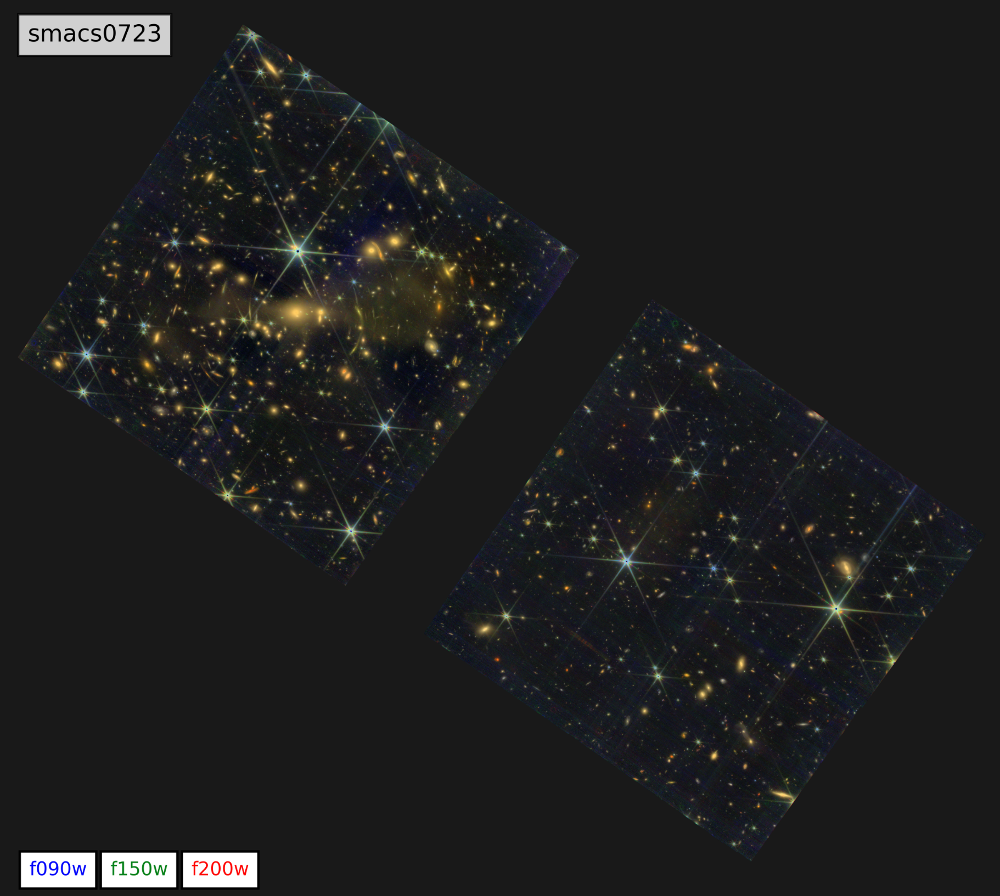

# Analyis of JWST Eearly Release Observations (ERO) Data for SMACS 0723 Cluster 

Please download the required HST and JWST data using a script (`download.sh`) inside the `data` directory. These data were processed by [Gabriel Brammer](https://gbrammer.github.io/) using [grizli](https://github.com/gbrammer/grizli).

